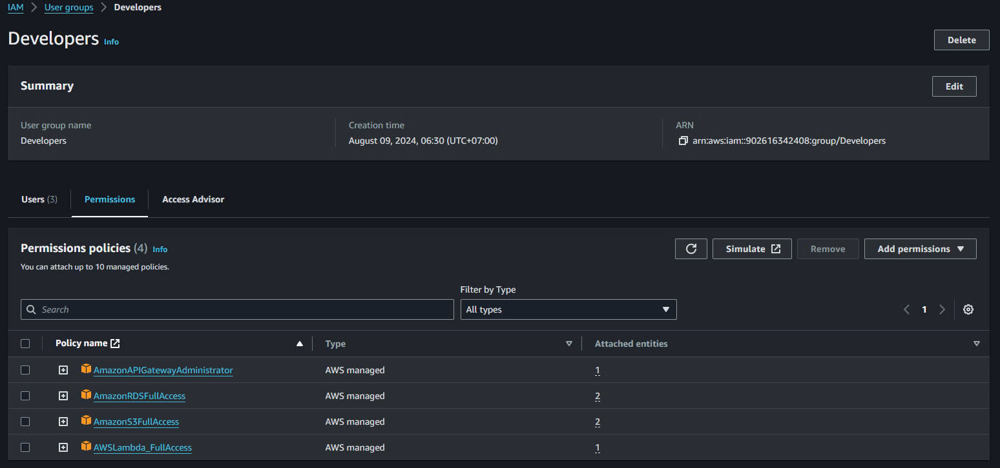

# Lab Hands On for IAM 

## Architecture Components

-   IAM Role:
    -    MyApp myapplication
         -    Purpose: This role is specifically designed to allow access to resources and actions related to the "myapplication" service and system
         -    Use Case: Typically assigned to Ec2 instances, Lambda functions, or other AWS services that need to interact with the "myapplication" resources. It can also be assumed by IAM Users and Groups to grant them temporary access to the application's resources.
  

-   IAM Group:
    -    Admins Group 
         -    Function: This Group is intended for users who need full administrative access across the AWS environment. Member of this group have permissions to manage all AWS resources, perform configuration changes, and access sensitive data.
         -  Permissions: The group is likely associated with a managed policy like AdministratorAccess, granting wide-ranging permissions. This group should be carefully managed to avoid potential security risks.
  
    -    Devops Group 
         -    Function: The Devops group resources on managing and maintaining the infrastructure and CI/CD pipelines, Members of this group have permissions related to infrastructure management, including EC2, RDS,S3, IAM and CI/CD tools like CodeDeploy and CodePipeline
         -    Permission: The group might be associated with policies like `PowerUserAccess` combined with specific permissions for services frequently used by Devops engineers, allowing them to deploy and manage applications without having full administrative privileges.
 
    -    Developers Group 
         - Function: This group is designed for users who primarily need access to development resources. Member of this group can interact with AWS resources such as Lambda, API Gateway, DynamoDB, and S3, typically for application development and testing.
         - Permissions: The group might be linked to policies like AmazonS3FullAccess, AWSLambdaFullAccess, or custom policies that provide the necessary permissions to develop, test, and deploy code without administrative privileges.

-   User:
    -   Alish
        -   Role:# Lab Hands-On for IAM: Architecture Components

## 1. IAM Roles

### **MyApp Role**
- **Purpose:** This role is specifically designed to allow access to resources and actions related to the "myapplication" service or system.
- **Use Case:** Typically assigned to EC2 instances, Lambda functions, or other AWS services that need to interact with the "myapplication" resources. It can also be assumed by IAM Users or Groups to grant them temporary access to the application's resource

## 2. IAM Groups

### **Admins Group**
- **Function:** This group is intended for users who need full administrative access across the AWS environment. Members of this group have permissions to manage all AWS resources, perform configuration changes, and access sensitive data.
- **Permissions:** The group is likely associated with a managed policy like `AdministratorAccess`, granting wide-ranging permissions. This group should be carefully managed to avoid potential security risks.
  

### **DevOps Group**
- **Function:** The DevOps group focuses on managing and maintaining the infrastructure and CI/CD pipelines. Members of this group have permissions related to infrastructure management, including EC2, RDS, S3, IAM, and CI/CD tools like CodeDeploy and CodePipeline.
- **Permissions:** The group might be associated with policies like `PowerUserAccess` combined with specific permissions for services frequently used by DevOps engineers, allowing them to deploy and manage applications without having full administrative privileges.

### **Developers Group**
- **Function:** This group is designed for users who primarily need access to development resources. Members of this group can interact with AWS resources such as Lambda, API Gateway, DynamoDB, and S3, typically for application development and testing.
- **Permissions:** The group might be linked to policies like `AmazonS3FullAccess`, `AWSLambdaFullAccess`, or custom policies that provide the necessary permissions to develop, test, and deploy code without administrative privileges.

## 3. IAM Users

### **Alish**
- **Role:** Alish might be an individual contributor who requires access to specific AWS resources. The user might be assigned direct policies or assume roles to gain necessary access, potentially belonging to one of the above groups for inherited permissions.
- **Access:** The specific permissions would depend on the tasks Alish needs to perform. Alish might have restricted access to certain services or be able to assume the `MyApp` role.

### **T. Lam (in Admins Group)**
- **Role:** T. Lam is a user with full administrative privileges across the AWS account. As a member of the Admins Group, T. Lam has the ability to perform any task within the AWS environment, including creating, modifying, and deleting resources.
- **Access:** T. Lam can manage all AWS resources, including those used by other groups, ensuring that they align with organizational standards and policies.

### **H. Vu, Q. Viet, H. Lam (in Developers Group)**
- **Role:** These users are developers who require access to development resources. As members of the Developers Group, they focus on application development, testing, and deployment within AWS.
- **Access:** They have permissions to create and manage development resources such as Lambda functions, API Gateways, and DynamoDB tables, allowing them to build and test applications effectively.

### **K. Dat, H. Nam (in DevOps Group)**
- **Role:** These users are part of the DevOps team responsible for managing the infrastructure and ensuring smooth deployment processes. As members of the DevOps Group, they are involved in tasks such as managing servers, networking, and automating deployment pipelines.
- **Access:** They have access to resources required for infrastructure management, including EC2 instances, S3 buckets, RDS instances, and tools like CodeDeploy and CodePipeline, enabling them to manage and maintain the environment effectively.

