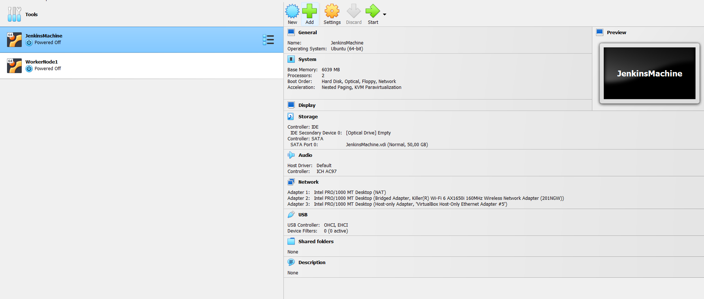
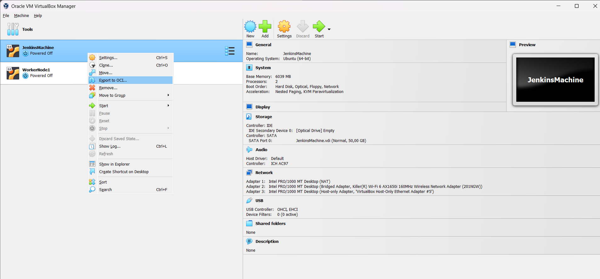
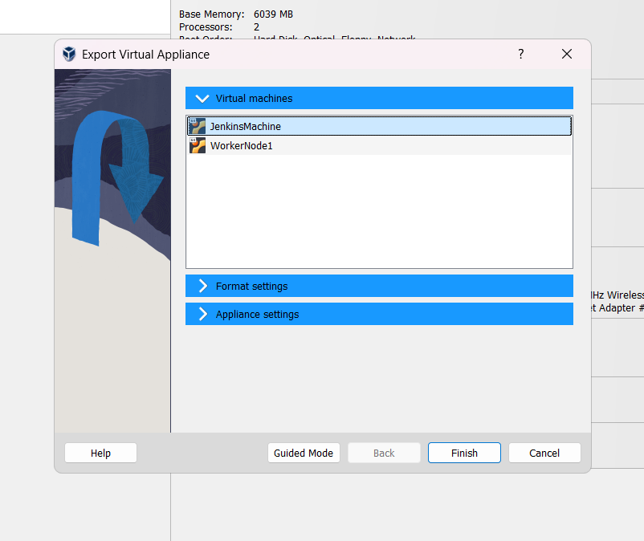
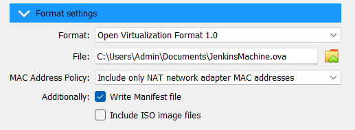
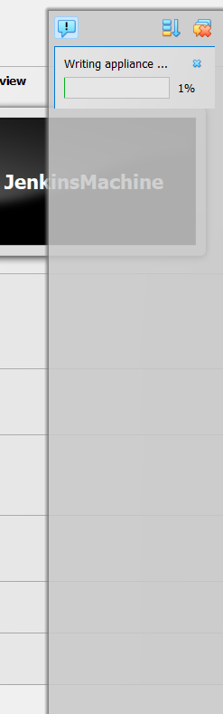
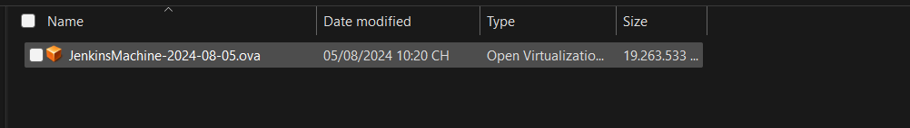

# Exporting a Virtual Machine in VirtualBox

## Step 1: Open VirtualBox

## Step 2: Select the Virtual Machine

## Step 3: Choose the Virtual Machine

## Step 4: Select Export Location and Format

## Step 5: Wait for Export to Complete

## Step 6: Verify the Exported File

