# Preparatory Steps

## Overview

The objective is to establish a VPC and subnet, along with a security group tailored for a **Linux EC2 Instance**. Concurrently, an IAM User and IAM Role will be created.

## Steps

### 1. Create VPC and Security Group

- **VPC after creation:**

  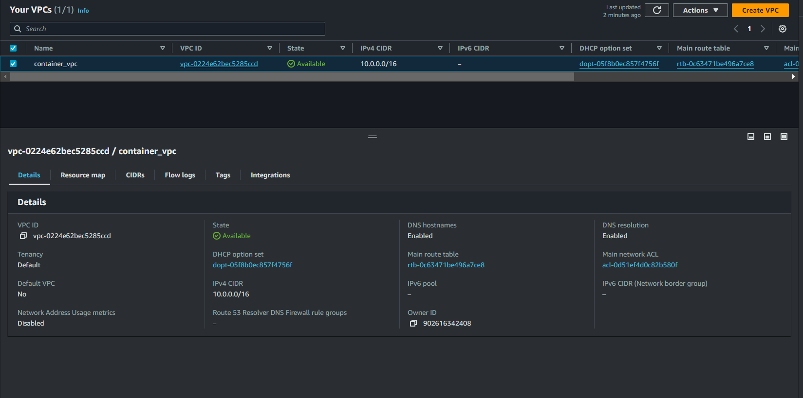

- **Subnet after creation:**

  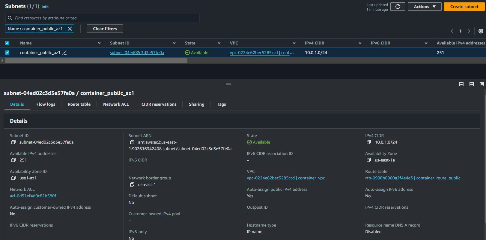

- **Security Group after creation:**

  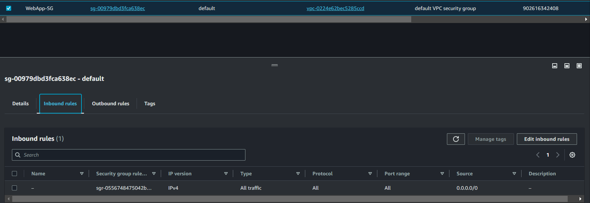

- **IAM Role for Grafana EC2:**

  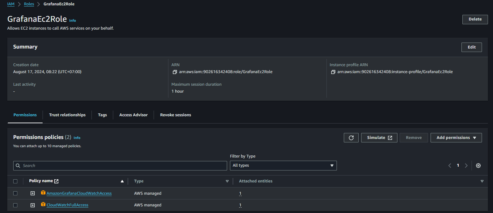

### 2. Create EC2 Instance

- **EC2 Instance after creation:**

  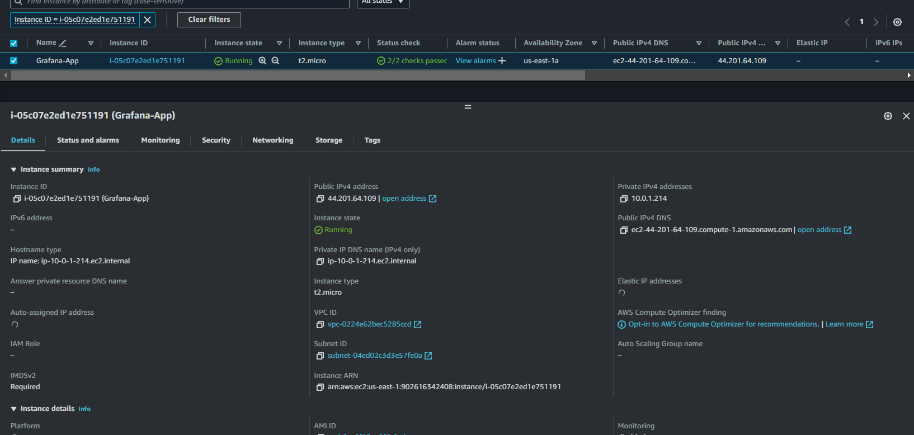

- **Attach Role to EC2 Instance:**

  - At the Instances Dashboard, select your EC2 instance, click **Actions**, choose **Security**, then click **Modify IAM role**.

    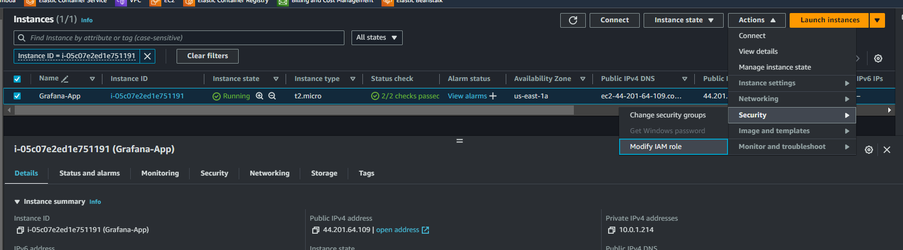

  - Choose `GrafanaEc2Role` and click **Update IAM Role**.

    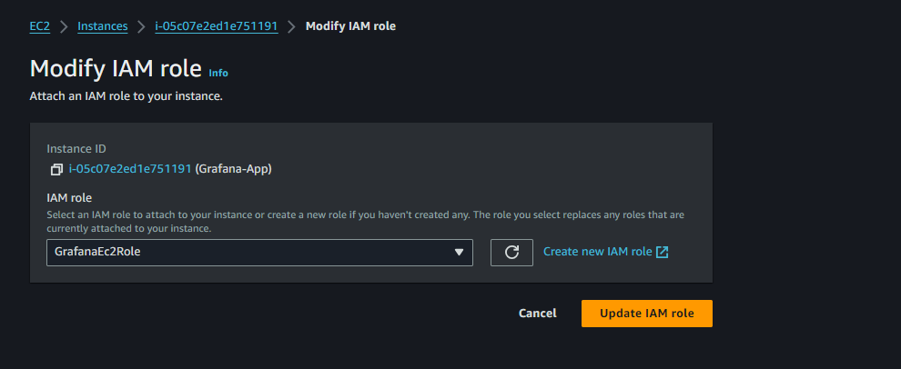

### 3. Install Grafana

- You can use **Client Connect** in the EC2 dashboard to connect to your EC2 instance.

  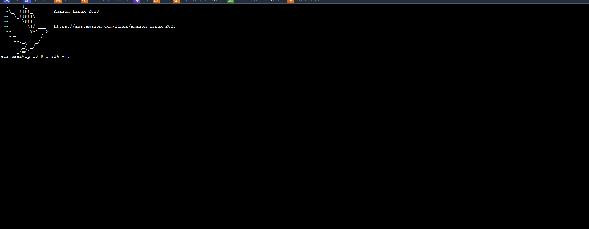

- Install Grafana using Docker:

    ```bash
    sudo yum update -y
    sudo yum install docker -y
    sudo usermod -a -G docker ec2-user
    sudo systemctl enable docker
    sudo systemctl start docker
    docker run -d -p 3000:3000 --name=grafana grafana/grafana
    ```

### 4. Configure Grafana

- **Login to Grafana** with the username and password: `admin`.

  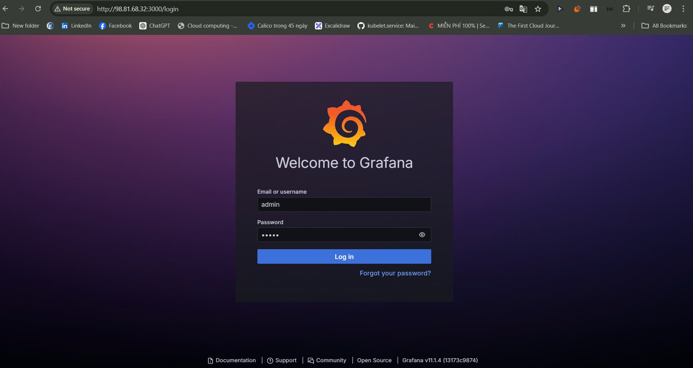

- **Add Grafana Data Sources** with CloudWatch.

  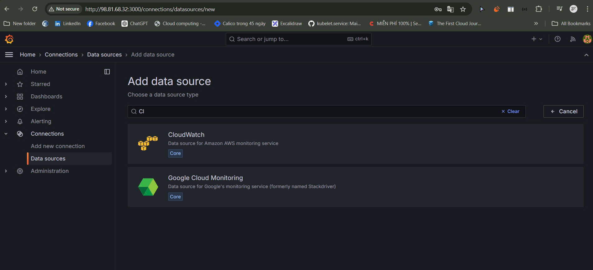

- **Configure Grafana**:

  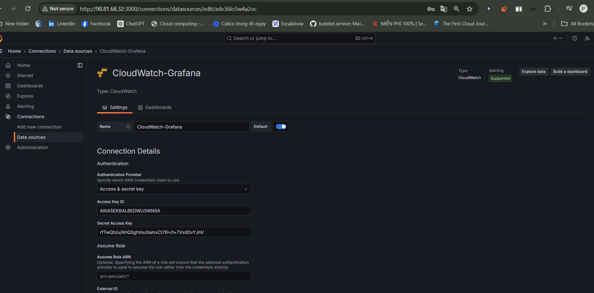

- **Edit Panel** with the EC2 Instance ID.

  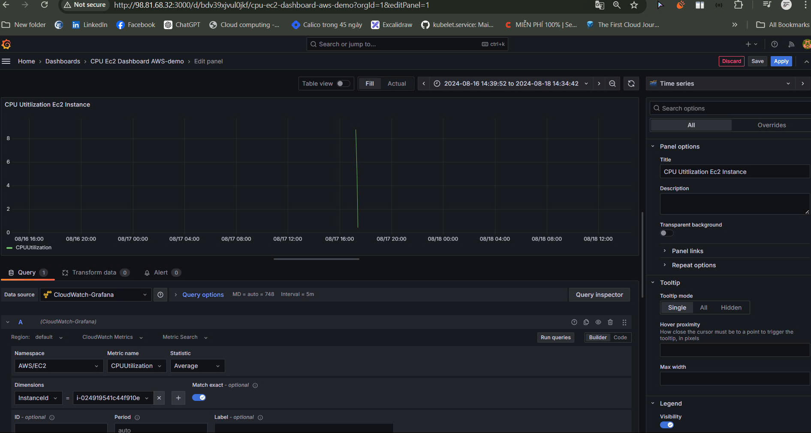

### 5. Result

- **CPU Utilization Visualization** of EC2 instances in the Grafana Dashboard.

  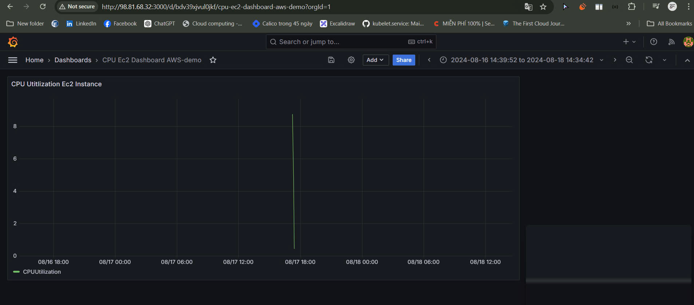
