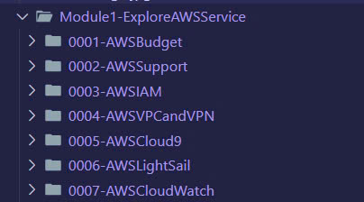

# AWS FCJ Workshop

## Overview

Welcome to the AWS FCJ Workshop! This workshop is designed to guide you through five essential modules, each focusing on different aspects of AWS Cloud. You'll find detailed labs and documentation within each module to help you gain hands-on experience with AWS services.

---

### Module 1 - Explore AWS Service

In this module, you will dive deep into various AWS services, gaining a comprehensive understanding of what AWS has to offer. From core services like EC2 and S3 to more advanced topics, this module is perfect for both beginners and experienced users looking to broaden their AWS knowledge.

---

### Module 2 - Migrate to AWS

This module focuses on migrating your existing infrastructure to AWS. You will learn best practices, tools, and strategies for a smooth migration. Whether you're moving a single application or your entire data center, this module will equip you with the knowledge to succeed.

---

### Module 3 - Optimizing the System

Learn how to optimize your AWS environment for performance, cost, and security. This module covers topics like cost management, performance tuning, and implementing security best practices. By the end of this module, you'll be able to maximize the efficiency of your AWS setup.

---

### Module 4 - Modernize the Application

Modernizing your application is key to taking full advantage of AWS capabilities. This module will guide you through transforming your legacy applications using modern AWS services like serverless computing, microservices, and CI/CD pipelines.

---

### Module 5 - Container Services

In this final module, you'll explore AWS container services like ECS, EKS, and Fargate. You'll learn how to deploy, manage, and scale containerized applications in the AWS cloud, providing a solid foundation for running modern, cloud-native applications.

---

## Getting Started

Each module includes hands-on labs and detailed documentation to guide you through the learning process. To get started, clone this repository and follow the instructions provided in each module's README file.

© 2024 AWS FCJ Workshop. All rights reserved.
